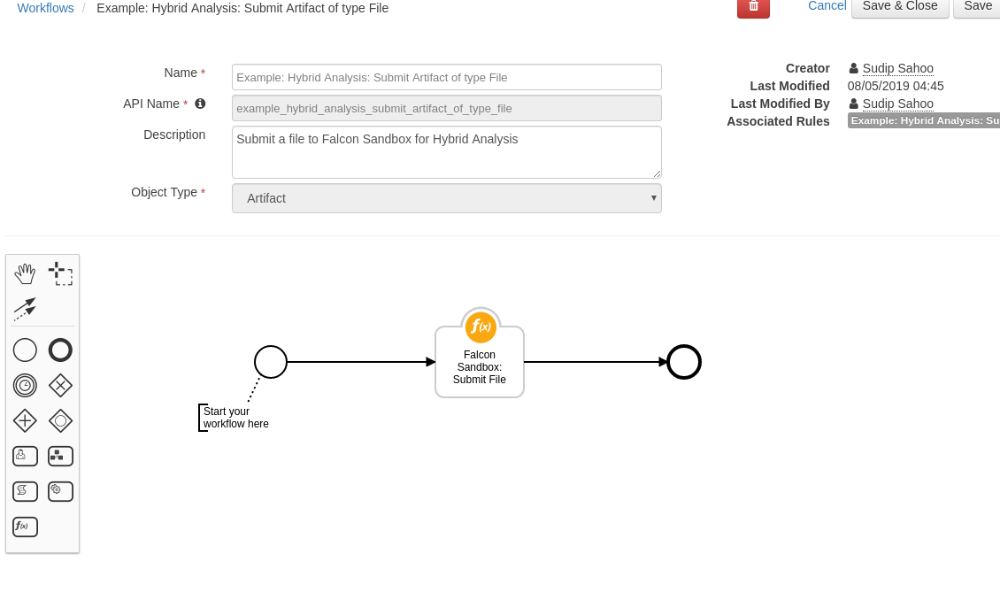
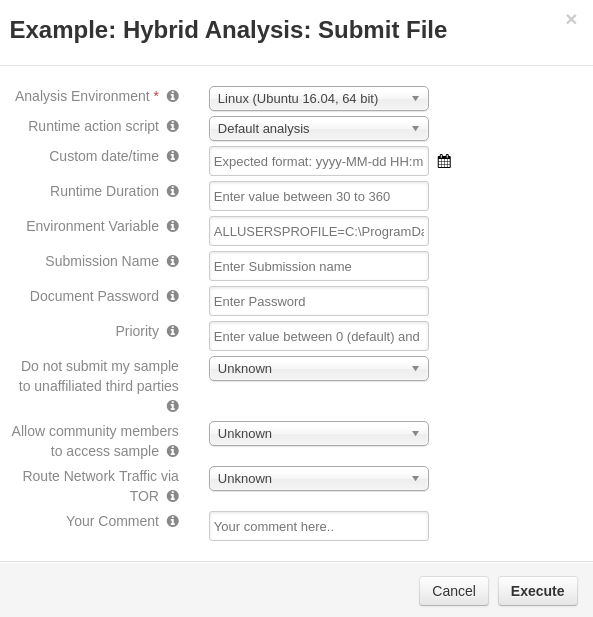

# Hybrid Analysis's Falcon Sandbox Public API Function for IBM Resilient

## Table of Contents
  - [About This Package](#about-this-package)
  - [Prerequisites](#prerequisites)
  - [Installation](#installation)
  - [Function Inputs](#function-inputs)
  - [Function Output](#function-output)
  - [Pre-Process Script](#pre-process-script)
  - [Post-Process Script](#post-process-script)
---

## About This Package:
**This package contains Functions that integrates with your Hybrid Analysis account using their Falcon Sandbox Public API V2.3.4**

* Integrates with Hybrid Analysis's Falcon Sandbox has a powerful and simple API that can be used to submit files/URLs for analysis, pull report data, but also perform advanced search queries.
* This package supports the following API calls:
  * Sandbox Submission `/submit/file`
  * Sandbox Submission `/submit/url-for-analysis`
  * Sandbox Report `/report/{id}/state`
  * Sandbox Report `/report/{id}/summary`

### Sample Workflow:
 

## Prerequisites:
* Resilient Appliance >= v31.0.0
* Integrations Server running resilient_circuits >= v30.0.0
* Account with [Hybrid Analysis](http://www.hybrid-analysis.com/api/v2/)
* An API Key from Hybrid Analysis Account

## Installation    
This package requires that it is installed on a RHEL or CentOS platform and uses the resilient-circuits framework.    
* Install this package using `pip`:
* Download the `.zip` file from our App Exchange and extract it. You will find a file called: `fn_falcon_sandbox-<version>.tar.gz`
* Copy this file to your Integrations Server
* To install the package, run:
    ```
    $ pip install pip install fn_falcon_sandbox-<version>.tar.gz
    ```
* To import the function, example rules and workflows into your Resilient Appliance, run:
    ```
    $ resilient-circuits customize -y -l fn-falcon-sandbox
    ```
* To update your `app.config` file with the required Hybrid Analysis configurations, run:
    ```
    $ resilient-circuits config -u
    ```
* Then open your `app.config` file and the following configuration data is added:
    ```
    [fn_falcon_sandbox]
    falcon_sandbox_api_key=<hybrid-analysis-api-key-here>
    falcon_sandbox_api_host=https://www.hybrid-analysis.com/api/v2
    fetch_report_timeout=600
    fetch_report_status_interval=60
    ```
    Please make sure minimum value for both `fetch_report_timeout` and `fetch_report_status_interval` is 60
* Run resilient-circuits:
    ```
    $ resilient-circuits run
    ```
* To uninstall:
    ```
    $ pip uninstall fn-falcon-sandbox
    ```

## Function Inputs:
 


### Submit URL
| Input Name | Type | Required | Info |
| ------------- | :--: | :-------:| ---- |
| `falcon_sandbox_environment` | `Select` | Yes | Select an Environment form list |
| `falcon_sandbox_action_script` | `Select` | No | Action scripts simulate human behaviour and interact with the client during an analysis (e.g. reboot during analysis). This feature is configurable in the standalone version |
| `falcon_sandbox_priority` | `Number` | No | priority value between 0 (default) and 100 (highest) |
| `falcon_sandbox_submit_name` | `String` | No | Optional ‘submission name’ field that will be used for file type detection and analysis |
| `falcon_sandbox_custom_run_time` | Date-time picker `String` | No | Optional runtime duration (in seconds) |
| `falcon_sandbox_environment_variable` | `String` | No | |
| `falcon_sandbox_tor_enabled_analysis` | `Boolean` | No | Route the TCP based traffic (HTTP/S, DNS, TLS, etc.) via TOR to avoid e.g. external IP fingerprinting. |
| `falcon_sandbox_allow_community_access` | `Boolean` | No | Please check 'Do not submit my sample to unaffiliated third parties' in order to toggle this access control. |
| `falcon_sandbox_no_share_third_party` | `Boolean` | No | The file will not be shared with an unaffiliated third party if you select this option. However, all reports are always shared with the community and include screenshots and extracted strings from the input file, its execution, and memory analysis. |
| `falcon_sandbox_custom_date_time` | Date-time picker `String` | No | Optional custom date/time that can be set for the analysis system. Expected format: yyyy-MM-dd HH:mm |
| `falcon_sandbox_comment` | `String` | No | Your comment here.. |
| `falcon_sandbox_incident_id` | `Number` | Yes | Takes form selected incident |
| `falcon_sandbox_artifact_id` | `Number` | Yes | Takes form selected artifact |

  

### Submit File
| Input Name | Type | Required | Info |
| ------------- | :--: | :-------:| ---- |
| `falcon_sandbox_environment` | `Select` | Yes | Select an Environment form list |
| `falcon_sandbox_action_script` | `Select` | No | Action scripts simulate human behaviour and interact with the client during an analysis (e.g. reboot during analysis). This feature is configurable in the standalone version |
| `falcon_sandbox_priority` | `Number` | No | priority value between 0 (default) and 100 (highest) |
| `falcon_sandbox_submit_name` | `String` | No | Optional ‘submission name’ field that will be used for file type detection and analysis |
| `falcon_sandbox_custom_run_time` | Date-time picker `String` | No | Optional runtime duration (in seconds) |
| `falcon_sandbox_environment_variable` | `String` | No | |
| `falcon_sandbox_tor_enabled_analysis` | `Boolean` | No | Route the TCP based traffic (HTTP/S, DNS, TLS, etc.) via TOR to avoid e.g. external IP fingerprinting. |
| `falcon_sandbox_allow_community_access` | `Boolean` | No | Please check 'Do not submit my sample to unaffiliated third parties' in order to toggle this access control. |
| `falcon_sandbox_no_share_third_party` | `Boolean` | No | The file will not be shared with an unaffiliated third party if you select this option. However, all reports are always shared with the community and include screenshots and extracted strings from the input file, its execution, and memory analysis. |
| `falcon_sandbox_custom_date_time` | Date-time picker `String` | No | Optional custom date/time that can be set for the analysis system. Expected format: yyyy-MM-dd HH:mm |
| `falcon_sandbox_document_password` | `String` | No | Must provide if uploading a password protected file/document. |
| `falcon_sandbox_comment` | `String` | No | Your comment here.. |
| `falcon_sandbox_artifact_id` | `Number` | Yes if Artifact Attachment| |
| `falcon_sandbox_incident_id` | `Number` | Yes | `NA` | Takes form selected incident |
| `falcon_sandbox_task_id` | `Number` | No | Takes form selected incident's selected task |
| `falcon_sandbox_attachment_id` | `Number` | Yes | Takes form selected incident's selected attachment |


## Function Output:
* To see the output of each of the API calls for this Function, we recommend running `resilient-circuits` in `DEBUG` mode.
* To do this run:
    ```
    $ resilient-circuits run --loglevel=DEBUG
    ```

### An Example Output:
```python
{
  "job_id": "5c8e2074038838185d878b01",
  "environment_id": 100,
  "environment_description": "Windows 7 32 bit",
  "size": 193536,
  "type": "PE32 executable (GUI) Intel 80386, for MS Windows",
  "type_short": [
    "peexe",
    "executable"
  ],
  "target_url": null,
  "state": "SUCCESS",
  "error_type": null,
  "error_origin": null,
  "submit_name": "e524d8066aa47ae1da9a73ee3eeb2262",
  "md5": "e524d8066aa47ae1da9a73ee3eeb2262",
  "sha1": "dc7cf5808417cd8d271e8270f44a1beb95c23ec0",
  "sha256": "ca30c42334fcc693320772b4ce1df26fe5f1d0110bc454ec6388d79dffea4ae8",
  "sha512": "8f483aab019f721f63a5eb0427dee67f9f6b470dae8e0fb62902350d96f2c91b315ee76e236d5b640a565c06d5b5de19e688c272d584f4d1fe895777c3f98aae",
  "ssdeep": "3072:W0ovoKI7BrcPRLokQUsdXuCDZ+GqWr2LshbX1xiaY6t5czEx2F870KO8H7kAkFpa:QoKIYKkydD0GtMsBX1xlVrUEgQy8H7kR",
  "imphash": "72779b978cbe963afc19d5595ff38c1f",
  "av_detect": 51,
  "vx_family": "Gen:Variant.Razy",
  "url_analysis": false,
  "analysis_start_time": "2019-03-17T10:15:52+00:00",
  "threat_score": 100,
  "interesting": false,
  "threat_level": 2,
  "verdict": "malicious",
  "certificates": [],
  "domains": [],
  "classification_tags": [],
  "compromised_hosts": [],
  "hosts": [],
  "total_network_connections": 0,
  "total_processes": 2,
  "total_signatures": 33,
  "extracted_files": [
    {
      "name": "WUDHost.exe",
      "file_path": "%LOCALAPPDATA%\\Microsoft\\WUDHost.exe",
      "file_size": 193536,
      "sha1": "dc7cf5808417cd8d271e8270f44a1beb95c23ec0",
      "sha256": "ca30c42334fcc693320772b4ce1df26fe5f1d0110bc454ec6388d79dffea4ae8",
      "md5": "e524d8066aa47ae1da9a73ee3eeb2262",
      "type_tags": [
        "peexe",
        "executable"
      ],
      "description": "PE32 executable (GUI) Intel 80386, for MS Windows",
      "runtime_process": "e524d8066aa47ae1da9a73ee3eeb2262.exe",
      "threat_level": 2,
      "threat_level_readable": "malicious",
      "av_label": "Gen:Variant.Razy",
      "av_matched": 36,
      "av_total": 70,
      "file_available_to_download": true
    }
  ],
  "processes": [
    {
      "uid": "00009924-00001720",
      "parentuid": null,
      "name": "e524d8066aa47ae1da9a73ee3eeb2262.exe",
      "normalized_path": "C:\\e524d8066aa47ae1da9a73ee3eeb2262.exe",
      "command_line": null,
      "sha256": "ca30c42334fcc693320772b4ce1df26fe5f1d0110bc454ec6388d79dffea4ae8",
      "av_label": "Gen:Variant.Razy",
      "av_matched": 36,
      "av_total": 70,
      "pid": null,
      "icon": null,
      "file_accesses": [],
      "created_files": [],
      "registry": [],
      "mutants": [],
      "handles": [],
      "streams": [],
      "script_calls": [],
      "process_flags": []
    },
    {
      "uid": "00009925-00003676",
      "parentuid": "00009924-00001720",
      "name": "WmiPrvSE.exe",
      "normalized_path": "%WINDIR%\\System32\\wbem\\WmiPrvSE.exe",
      "command_line": null,
      "sha256": null,
      "av_label": null,
      "av_matched": null,
      "av_total": null,
      "pid": null,
      "icon": null,
      "file_accesses": [],
      "created_files": [],
      "registry": [],
      "mutants": [],
      "handles": [],
      "streams": [],
      "script_calls": [],
      "process_flags": []
    }
  ],
  "file_metadata": null,
  "tags": [],
  "mitre_attcks": [
    {
      "tactic": "Execution",
      "technique": "Service Execution",
      "attck_id": "T1035",
      "attck_id_wiki": "https://attack.mitre.org/wiki/Technique/T1035",
      "malicious_identifiers_count": 0,
      "malicious_identifiers": [],
      "suspicious_identifiers_count": 1,
      "suspicious_identifiers": [],
      "informative_identifiers_count": 0,
      "informative_identifiers": []
    },
    {
      "tactic": "Execution",
      "technique": "Windows Management Instrumentation",
      "attck_id": "T1047",
      "attck_id_wiki": "https://attack.mitre.org/wiki/Technique/T1047",
      "malicious_identifiers_count": 0,
      "malicious_identifiers": [],
      "suspicious_identifiers_count": 1,
      "suspicious_identifiers": [],
      "informative_identifiers_count": 0,
      "informative_identifiers": []
    },
    {
      "tactic": "Persistence",
      "technique": "Hooking",
      "attck_id": "T1179",
      "attck_id_wiki": "https://attack.mitre.org/wiki/Technique/T1179",
      "malicious_identifiers_count": 0,
      "malicious_identifiers": [],
      "suspicious_identifiers_count": 1,
      "suspicious_identifiers": [],
      "informative_identifiers_count": 0,
      "informative_identifiers": []
    },
    {
      "tactic": "Persistence",
      "technique": "Kernel Modules and Extensions",
      "attck_id": "T1215",
      "attck_id_wiki": "https://attack.mitre.org/wiki/Technique/T1215",
      "malicious_identifiers_count": 0,
      "malicious_identifiers": [],
      "suspicious_identifiers_count": 0,
      "suspicious_identifiers": [],
      "informative_identifiers_count": 1,
      "informative_identifiers": []
    },
    {
      "tactic": "Privilege Escalation",
      "technique": "Hooking",
      "attck_id": "T1179",
      "attck_id_wiki": "https://attack.mitre.org/wiki/Technique/T1179",
      "malicious_identifiers_count": 0,
      "malicious_identifiers": [],
      "suspicious_identifiers_count": 1,
      "suspicious_identifiers": [],
      "informative_identifiers_count": 0,
      "informative_identifiers": []
    },
    {
      "tactic": "Credential Access",
      "technique": "Hooking",
      "attck_id": "T1179",
      "attck_id_wiki": "https://attack.mitre.org/wiki/Technique/T1179",
      "malicious_identifiers_count": 0,
      "malicious_identifiers": [],
      "suspicious_identifiers_count": 1,
      "suspicious_identifiers": [],
      "informative_identifiers_count": 0,
      "informative_identifiers": []
    },
    {
      "tactic": "Discovery",
      "technique": "System Time Discovery",
      "attck_id": "T1124",
      "attck_id_wiki": "https://attack.mitre.org/wiki/Technique/T1124",
      "malicious_identifiers_count": 0,
      "malicious_identifiers": [],
      "suspicious_identifiers_count": 0,
      "suspicious_identifiers": [],
      "informative_identifiers_count": 1,
      "informative_identifiers": []
    },
    {
      "tactic": "Discovery",
      "technique": "Query Registry",
      "attck_id": "T1012",
      "attck_id_wiki": "https://attack.mitre.org/wiki/Technique/T1012",
      "malicious_identifiers_count": 0,
      "malicious_identifiers": [],
      "suspicious_identifiers_count": 3,
      "suspicious_identifiers": [],
      "informative_identifiers_count": 0,
      "informative_identifiers": []
    },
    {
      "tactic": "Discovery",
      "technique": "Peripheral Device Discovery",
      "attck_id": "T1120",
      "attck_id_wiki": "https://attack.mitre.org/wiki/Technique/T1120",
      "malicious_identifiers_count": 0,
      "malicious_identifiers": [],
      "suspicious_identifiers_count": 0,
      "suspicious_identifiers": [],
      "informative_identifiers_count": 2,
      "informative_identifiers": []
    },
    {
      "tactic": "Discovery",
      "technique": "System Information Discovery",
      "attck_id": "T1082",
      "attck_id_wiki": "https://attack.mitre.org/wiki/Technique/T1082",
      "malicious_identifiers_count": 0,
      "malicious_identifiers": [],
      "suspicious_identifiers_count": 1,
      "suspicious_identifiers": [],
      "informative_identifiers_count": 0,
      "informative_identifiers": []
    }
  ]
}
```
## Pre-Process Script:
* This function apart form mandetory inputs takes few runtime inputs from user 
```python
# Mandatory input fields
inputs.falcon_sandbox_incident_id = incident.id
inputs.falcon_sandbox_artifact_id = artifact.id

# Optional input fields
inputs.falcon_sandbox_environment = rule.properties.falcon_sandbox_analysis_environments
inputs.falcon_sandbox_action_script = rule.properties.falcon_sandbox_runtime_action_script
inputs.falcon_sandbox_allow_community_access = rule.properties.falcon_sandbox_allow_community_members_to_access_sample
inputs.falcon_sandbox_comment = rule.properties.falcon_sandbox_your_comment
inputs.falcon_sandbox_custom_date_time = rule.properties.falcon_sandbox_custom_datetime
inputs.falcon_sandbox_custom_run_time = rule.properties.falcon_sandbox_runtime_duration
inputs.falcon_sandbox_document_password = rule.properties.falcon_sandbox_document_password
inputs.falcon_sandbox_environment_variable = rule.properties.falcon_sandbox_environment_variable
inputs.falcon_sandbox_no_share_third_party = rule.properties.falcon_sandbox_do_not_submit_my_sample_to_unaffiliated_third_parties
inputs.falcon_sandbox_priority = rule.properties.falcon_sandbox_priority
inputs.falcon_sandbox_submit_name = rule.properties.falcon_sandbox_submission_name
inputs.falcon_sandbox_tor_enabled_analysis = rule.properties.falcon_sandbox_route_network_traffic_via_tor
```

## Post-Process Script:
* This example adds a note to Example Incident:.
```python
incident.addNote(results['raw'])
```
